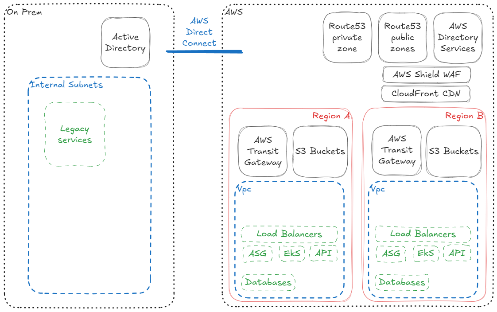
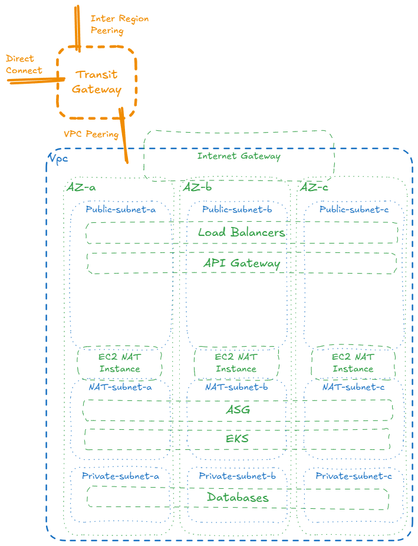
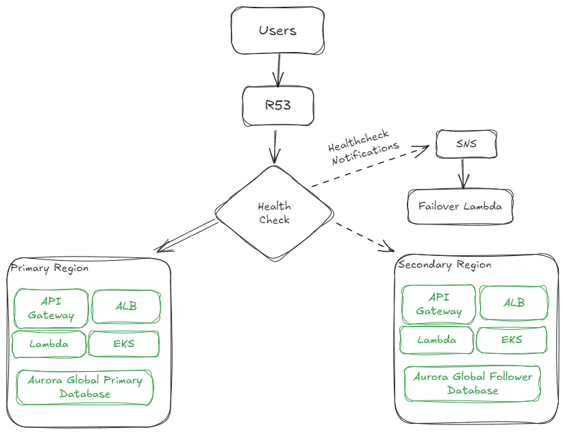

## Architecture Overview



## Initial Considerations

FastHeal has a requirement to migrate from an on-premise to hybrid cloud.
Given the size and scale of the operation, 1 Billion users, even with 1% MAU (Monthly Active Users), would be MAU of 10 Million users. 
1 Billion users is approaching the total populations of Europe and North America combined, which would require a multi region approach for both security, resilience and scaling purposes. Some regions may not be enabled for some accounts, such as Middle East and Asia Pacific regions and may require enabling prior to deployment if required for those markets.
AWS Services in Mainland China also require a separately created account to operate, which may need to be managed separately. 

As we are looking at more than just one country, we will also need to consider data residency, legal and compliance regulations. Only using AWS services that are HIPAA certified.

To mitigate AWS Service Quotas, it may well be worth considering splitting regions and/or business units in to separate AWS accounts under a single AWS Organisation.

This would still allow centralised management and billing under AWS Organisations whilst allow using separate AWS Accounts to create silos for data residency legal and compliance reasons.

## Network Overview

The Architecture should be split into regions, each region hosting a Transit Gateway and one or more VPC.


### Transit Gateways
One region should be nominated as the primary region, closest geographically to the existing on-premise data centre.
This region should use AWS Direct Connect to peer with the Transit Gateway for that region.
The Direct Connect peering would advertise routes for all the VPCs within all regions.

Each Transit Gateway would need to have DNS Support enabled to allow Direct Connect to resolve Local Zone DNS queries.
Each Transit Gateway will need to be allocated a unique AS number from the RFC-6996 private range, the 16bit range should be more than sufficient. 
If there may be a possibility of adding VPNs for site-2-site connections in the future, you may want to allocate a CIDR (see Subnetting later) to the primary Transit Gateway that is non-overlapping with on-premise or VPC subnets. 

### VPCs, Subnetting and Routing

Given the potential size of the organisation and the requirement for scaling, I would allocate each production AWS VPC a `/16` CIDR from the Class A RFC-1918 reserved IP Ranges.

The `x` in the following examples would need to be unique and allocated by an internal team.

I would logically split the VPC CIDR into 3 public routable subnets of `/20` for Load Balancers and Public API Gateway services. 
```
10.x.0.0/20
10.x.16.0/20
10.x.32.0/20
```
This would allow 1 subnet capable of hosting 4094 IPs in each of three Availability Zones.
AWS will allocate up to 100 nodes across all AZs before sharding is necessary, and recommend once you reach approximate 50 nodes to allow for growth. This would allow for approximately 300 load balancers per region. 

I would split the remaining CIDR into 6 `/19` subnets each providing 8190 hosts per Availability Zone. 
3 NAT routable private subnets via an EC2 NAT Instance. 

```
10.x.64.0/19
10.x.96.0/19
10.x.128.0/19
```

This would be used to host the majority of the EC2 instances, EKS nodes, internal load balancers and/or VPC attached Lambda functions.

Finally create 3 Non-internet-routable private subnets for databases etc. that do not require internet access.
```
10.x.160.0/19
10.x.192.0/19
10.x.224.0/19
```

## Multi Region Operations

For web services I would use a secondary origin in CloudFront to attempt the same request from the secondary origin when the primary origin returns an non-success status code or fails to connect to the primary origin. 
This would reduce latency for already cached content, however for cache misses CloudFront will continually request the primary origin first before failing to the secondary. 
Careful consideration of the timeouts is therefore required.

For API and Web Application requests instead I would use Route 53 Health checks to poll the relevant endpoints for availability. Route53 has the ability to automatically failover the record to the secondary endpoints. 
For services that don't automatically failover between regions, such as Aurora Global Databases, I would send health check status changes via SNS and trigger a Lambda function or SSM Runbooks to start failover of other dependant services.

This lambda could also be used to supress further health checks for a period to prevent failbacks until relevant teams have investigated. 


## Route 53 Local Zones

AWS Route53 supports usage of a local VPC Zones, which allow the overriding of a public hosted record to an internal VPC address.
Each local R53 Zone needs to be specifically attached to a VPC within a Region. 

One method to achieve the requirement for a hybrid on-premise local zone, would be to enable DNS support on the Transit Gateway VPC attachments, to allow propagation of DNS queries and configure on-premise resolvers to direct DNS requests to the AWS Local Zone R53 Resolvers. 

As each R53 Zone needs to be attached to a VPC within it's region, I would recommend naming the zones with account/region specifiers. e.g.
```
prod.eu-west-1.fastheal.com
prod.us-east-2.fastheal.com
prod.us-west-2.fastheal.com
```
Then configure a single local zone in the primary region for the `fastheal.com` domain. Configure this with health checks for failover, allowing regional failover or load balancing (if required.)

## File Storage

Create S3 buckets for file storage with the relevant IAM policies for CRUD operations. 
Buckets should each have Lifecycle policies defined to migrate objects to Intelligent Tiering for cost optimisation.
Buckets should have bucket versioning enabled with lifecycle policies to determine the number and duration of object copies to keep if updated or deleted.
Additionally buckets may have replication enabled to replicate objects to a different region for backup and availability. The backup region may have different lifecycle policies if required.
Buckets that are being used to store regulated documents, access and audit logs or critical backups may also have Object Lock enabled, to prevent modification or deletion post creation. 

## Security Overview
### Network Security

#### Inbound Public Traffic

Use AWS WAF allowing fine grained multi-dimensional rules to block traffic, rate limiting on specific endpoints such as authentication to prevent credential stuffing.

AWS WAF may also be used to segment traffic from suspect sources and add extra steps such as proof of work or CAPTCHAs. 

There are rule sets available to bot mitigation and fraud detection as well.

AWS Shield Advanced may a useful cost optimisation as it includes all AWS WAF features for no extra cost, has extended rule sets and enhanced DDoS Protection. 
AWS has it's own internal response team which monitor Shield Advanced customers and can proactively manage features on the customers behalf during DDoS events.

#### Internal VPC Traffic

Use micro-segmentation using AWS Security Groups.
Auto Scaling Groups (ASG) Security Groups only permit ingress from their associated Load Balancer.
Internal Load Balancers only permit ingress from specific security groups of services that use them.

### Monitoring and Compliance

Use AWS Inspector to scan containers, lambdas and EC2 images reporting vulnerabilities and generating SBOMs automatically.

Use AWS GuardDuty to monitor traffic and IAM access patterns, reporting unusual activities.

Use AWS Config to record changes to configuration, when and by whom, generate compliance reports for versions and tagging etc for billing purposes.

Use AWS CloudTrail to record all API interactions for accounts, useful for troubleshooting API error rates etc, and also for creating filters for specific events that may be directed to a SIEM or NOC/SOC for remediation and investigation.

AWS Simple Systems Management to create automations for runbooks to handle failovers or patching and maintenance periods.

Record LoadBalancer and CloudFront Logs in S3, useful for troubleshooting, error and latency reporting and capacity management.

## Kubernetes

On-premise workloads on Kubernetes can stay on-premise initially, being accessed via Direct Connect with Load Balancers directing traffic from within an AWS Region.

On-premise could be migrated to run on AWS Outposts initially to allow local on-premise nodes and/or clusters first whilst utilising the AWS Control Plane in the EKS Dashboard.

Once teams are familiar with AWS EKS, workloads could be migrated from on-premise to AWS EKS running in region, utilising either AWS Fargate or Amazon EC2 instances.

## Directory Services

Each AWS Region can host a AWS Directory Service (AWS DS) instance. 
AWS DS can be used to join an existing on-premise Active Directory (AD) instance and replicate to multiple regions. 
Alternatively it can be promoted to the primary AD and the on-premise can become a replica to maintain local authentication.

AWS DS and AD can be used as an identity source for AWS IAM Identity Centre to allow AD credentials to be used or Single Sign-On (SSO) into AWS Services, allowing FastHeal to leverage existing roles and policy permissions.

AWS AD services are a HIPAA certified managed service, not requiring maintenance of the Domain Controllers for security updates, etc and backups are managed by AWS.

## Cost Efficiency

Purchase AWS Compute Savings Plan to cover the basic daily EC2/Fargate/Lambda utilisation at off-peak. This allows flexibility to migrate workloads between instance types, whilst still saving approximately 30% on compute costs.

Use Spot-Fleets to cover as much peak traffic scaling for EC2 and/or EKS nodes. Spot fleets are normally about 20% of the on demand cost for instances, as long as the workload can tolerate instance loss/replacement without error.
You can optimise fleets for instance longevity versus cost performance if necessary on a fleet by fleet basis.

Use EC2 Nat Gateways rather than AWS NAT Gateway instances, although the Standing charge would probably be similar, the network ingress/egress charges would be significantly more.

Use RDS Aurora Postgres I/O Optimised Instances with Reservations. Reservations will save approx 30%, more if willing to purchase longer terms. I/O operations are charged on top of storage and compute and may be a significant factor, switching to I/O optimised includes all I/O charges for a fix fee based on instance size and could reduce spend.

Enable AWS S3 Intelligent Tiering on S3 Buckets, after the initial 30 days, S3 will automatically move individual items to the most cost-efficient storage tier, and there are no additional charges when items are moved back up from cold to warm storage tiers.

Use CloudFront for customer facing requests with suitable caching policies. Saving bandwidth charges from frontend servers and decreasing latency for clients. 
AWS will negotiate on CloudFront charges for a volume discount, but details are under NDA.

Negotiate with your AWS Technical Account Manager (TAM), AWS may offer credits for exploring new technologies and you may be eligible for AWS Credits when working on Well Architected framework remediations and other deals covered by an NDA. 